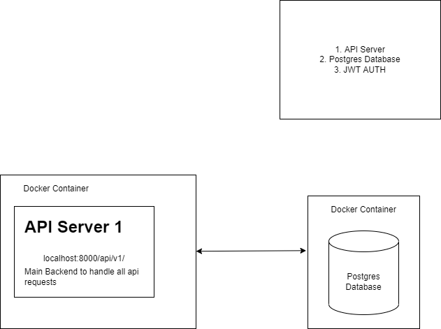

## Welcome
Here lies the Documentation for Django Auth API. This is a base template for a simple Django based backend API with JWT Authentication.

### Overview
- JWT Auth
- Anonymous posting
- Cross-Platform Support
- Open Source

### Basic Features
- Create account
- Create Anonymous Posts
  - Create a post anonumously to share your thoughts.
  - Comment on other users posts

## Database Diagram

--> *Preview :*

  

# Architecture Of the App!

    

